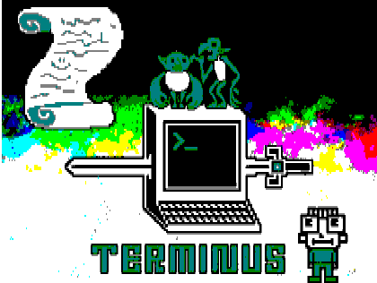

|  | | 
| :--------------------------- | :--------------------------- | 
|| Contribuer : [Wiki en Français](https://github.com/luffah/Terminus/wiki)     Essayer : [Démo du jeu (alpha)](http://luffah.xyz/bidules/Terminus/)    Licenses : [GPLv2](./LICENSE.md)     Version originale (English) : [mprat's Terminus game](http://mprat.github.io/Terminus/) ([code](https://github.com/mprat/Terminus/))  |

 *(Les fondements du jeu sont en cours de révision, cela aura un impact sur : les dialogues, les actions possibles, et le design.)*   
 
| [Français](./readme.fr.md) |  | [English](./readme.en.md) |
| :---                 | - | :---    |
| Dans un univers où la magie a été remplacée par le mystérieux pouvoir de la ligne de commande, vous incarnez un personnage démuni qui n'aura d'autre choix que d'en servir pour reprendre le contrôle de sa vie. [>> wiki](https://github.com/luffah/Terminus/wiki) [>> install](./readme.fr.md)|| In a mysterious land, both physical and magical powers had been surpassed by a new power : the command line. Lost somewhere in this land, you discover that you could use this power without knowing how. [>> wiki (not available)](https://github.com/luffah/Terminus/wiki/Home.en) [>> install](./readme.en.md) |

## En cours de développement
La branche la plus active en ce moment est [develop](https://github.com/luffah/Terminus/tree/develop).

On y expérimente une manière moins monolithique – et plus accessible – de concevoir un univers ludique représenté par une arborescence de dossiers.
* on créé directement les dossiers (avec image et texte) dans les standard de la ligne de commande, ou avec un gestionnaire de fichier
* les codes liéés au comportement de l'écosystème restent en javascript mais sont principalement mise en oeuvre avec une liste d'attributs; ce qui ouvre une possibilité de portage en d'autre langages informatique
* le 'moteur' qui gère le système (systeme de fichier + shell + évènements) est séparé; les modèles et vues y sont interchangeables.
* retrouver quel artiste a conçu quel image/son est facilité par des fichiers de crédits (cf `ogaget` pour les remplir automatiquement). Les crédits permettent aussi de retrouvrer et télécharger la source (ce qui évite de mettre fichiers multimédia sur git)
* ajout d'outils pour le développement et le test
